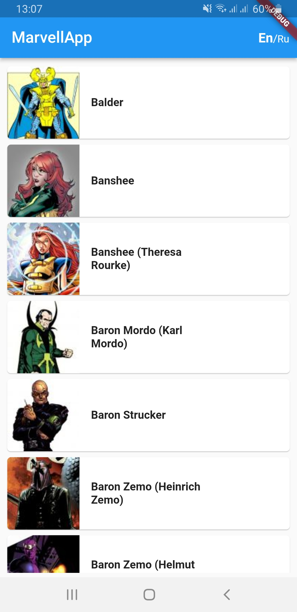
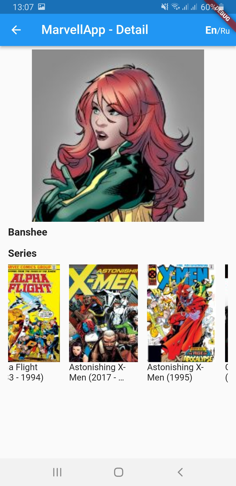
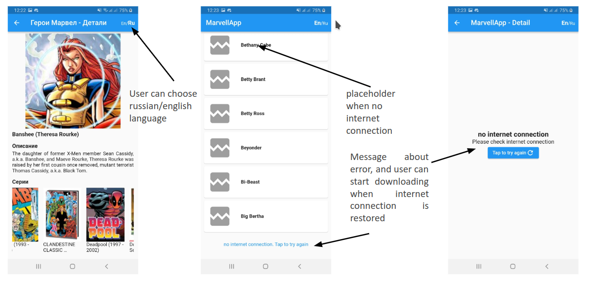
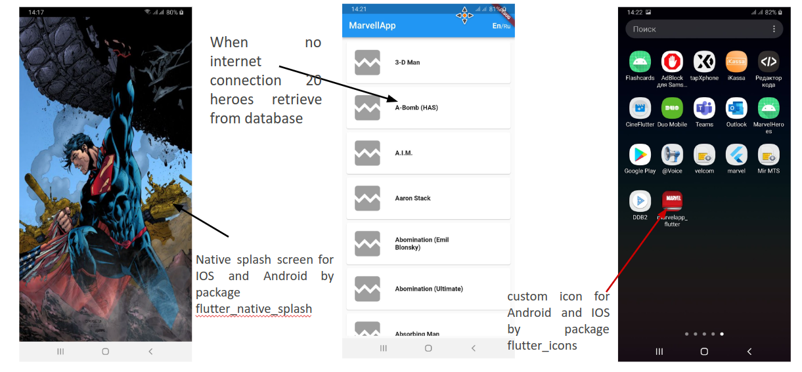

# Marvel heroes flutter app

This app is a client-server application, which use the Marvel Comics API [https://developer.marvel.com/](https://developer.marvel.com/)
This application shows list of Marvel heroes on the first screen and shows list of series, description, name and picture of selected hero
on the details screen.

<p align="justify">



</p>

In this app applied next technologies: 
- Dio
- Drift
- Equatable
- Flutter bloc
- Get it
- Retrofit

Clean architecture was used to create the application.

## Features of the app
<p align="center">

</p>
<p align="center">

</p>

## Getting started

- For download this project use next command:

```sh
git clone https://github.com/alexsit19/marvelapp_flutter
```
- next step: open marvelapp_flutter in Android Studio
- in android studio go in file/settings, choose Languages & Frameworks,
choose Dart point and enter path to dart on your hard disc.
- in terminal of Android Studio run command: 
```sh
  flutter run
```
 